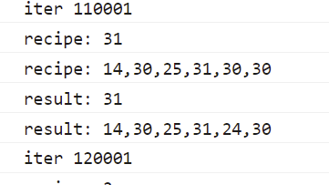

# USTC Hackergame 2021 Writeup By ReinWD

## 前言
关注这个比赛也有一段时间了 
最开始是在群里看到有人在水 [114514论证器](https://github.com/USTC-Hackergame/hackergame2020-writeups/blob/master/official/%E8%B6%85%E7%B2%BE%E5%B7%A7%E7%9A%84%E6%95%B0%E5%AD%97%E8%AE%BA%E8%AF%81%E5%99%A8/README.md) 去看了题解 
今年恰好想起来了就参与一下玩一玩 
（水平好菜只会找general做）

## 做出的题目
签到、进制十六————参上、去吧！追寻自由的电波、猫咪问答 Pro Max、赛博厨房（0,1,2）

## 看了但是没做完的题目
卖瓜、透明的文件、旅行照片、FLAG 助力大红包、minecRaft、p😭q 
（好菜好菜好菜）

## 正文
### 签到
看到1970就想到是时间戳的题。点击next之后观察到地址栏多了page=1的参数，直接尝试在控制台 `new Date().getTime()` 丢过去，结果显示太大。（图是写writeup的时候截的）

尝试删掉几位数之后发现时间还在很久以后，发现单位是秒，再删一位之后得到flag。


flag{HappyHacking2021-781c8852bb}

### 进制十六————参上
简单的二进制阅读题，把盖住的部分解一下就行了 
（不过还是因为眼瞎抄错行导致提交了三四次才把正确flag找出来） 
因为没有好用的bin编辑器所以是用java parse了一下 bin code，输出成字符串。


### 去吧！追寻自由的电波
无线电用字母基本是用一个特定单词来表达一个字母，避免在传输过程中失真导致理解偏差。 
之前玩模飞的时候简单听过所以丢到音频编辑器里降个速一听就出来了。 

flag{phoneticab}

### 猫咪问答 Pro Max
一顿好找.jpg 
属实要把搜索引擎玩明白了才行 

#### Q1
	「2017 年，中科大信息安全俱乐部（SEC@USTC）并入中科大 Linux 用户协会（USTCLUG）。目前，信息安全俱乐部的域名（sec.ustc.edu.cn）已经无法访问，但你能找到信息安全俱乐部的社团章程在哪一天的会员代表大会上通过的吗？」

这题搜的时候已经搜不到原址了，直接想在 `webarchive` 里面会不会有存档。搜了一下 `sec.ustc.edu.cn` 发现有，进去找了一下找到了。

#### Q2
	「中国科学技术大学 Linux 用户协会在近五年多少次被评为校五星级社团」

一开始以为会在某些新闻/公告找得到所以走弯路了，找了半天发现在LUG的介绍页面就有写。 
以为是4次，最后反复确认了其余几个题正确之后，把该题改为5成功获取到flag。 
（介绍页面记得及时更新（敲打））

#### Q3
	「中国科学技术大学 Linux 用户协会位于西区图书馆的活动室门口的牌子上“LUG @ USTC”下方的小字是？」

在 `LUG-每周小聚` 页面戳到了[ftp站的入口](https://ftp.lug.ustc.edu.cn/weekly_party/) 看到左边有照片列表。感觉找一找应该可以找得到对应的照片。

`2016-活动室搬迁`文件夹嫌疑很大，第一次看居然没看到。根据 `活动室` 线索在 `LUG-LUG活动` 页面寻找相关图片无果（通常也不会拍门口）。复核 `2016-活动室搬迁` 中的照片发现题解 `Development Team of Library` 
~(然后打少一个`e`, 数字数才发现)~

#### Q4
	「在 SIGBOVIK 2021 的一篇关于二进制 Newcomb-Benford 定律的论文中，作者一共展示了多少个数据集对其理论结果进行验证？」

查到对应论文之后，看到关于 `Theory` 部分并未使用数据集进行论证，但是附了1+13张图。简单看了之后发现后13张图与题干提到的`数据集`相关。故填入答案 `13`。

#### Q5
	「不严格遵循协议规范的操作着实令人生厌，好在 IETF 于 2021 年成立了 Protocol Police 以监督并惩戒所有违背 RFC 文档的行为个体。假如你发现了某位同学可能违反了协议规范，根据 Protocol Police 相关文档中规定的举报方法，你应该将你的举报信发往何处？」

直接搜索 `rfc protocol police`，看目录中关于 `reporting` 相关内容 
看到 `/dev/null` 的时候直接笑出了声，一看果然是今年4月1号发的rfc。


flag{8804d9f3_91f53c077e}

### 赛博厨房
本次竞赛最关心的一道题（包装得不错，前两问给人这道题没什么难度的错觉）

#### 普通人玩游戏的过程 
编写程序之后添加，发现`学习中`，感觉不对劲就直接开了控制台看。发现是vue写的所以直接开始从代码里面找这里的定义。发现控制这里`学习中`的变量在`app.programs[index].learned`，使用`app.programs[3].learned=true`修改之后直接提交，返回结果是`You win!`，不过跟随的结果是`can not read property 'trim' of undefined`，而不是flag（这里其实是自己没审好题，以为学要学一天的意思是挂机挂一天，所以直接去日程序了）。

前两问复杂度低，根据上文的做法，简单尝试几次即可获取到flag。

#### 事情开始不对劲

第三问开始，发现程序可以使用 走->拿->回->放 的简单指令实现，菜谱长度也足够在72条指令以内实现完成，使用编辑器+简单代码生成手撕了几张菜谱（10张左右）发现一直提示`can not read property 'trim' of undefined`。使用js重新实现了读菜谱、写指令的函数之后反复做请求试图得到结果。挂机跑了五万条左右（没错一开始甚至没控制好并发量直接把服务器打了个502（坏笑））觉得题目肯定没这么简单所以拿下来分析了一下。

简单看了一下分发下来的代码，win与否的判定其实直接写在了网页的script标签里。代码节选如下

``` Javascript
 runProgram(program) {
            this.programExecutions.push(program.indexInBackup);//这行是比较关键的一个线索
            //本地验证是否win的结果
			let {vm, finished, win, msg, log} = CyberCook.step(this.vm, program.content);
            if (!finished) {
              alert(msg);
            }
            if (win) {
              console.log('你赢了，正在获取 flag……');
              console.log([...this.programsBackup]);
              console.log([...this.programExecutions]);
              //真正的getFlag验证
              axios.post('/verify', {
                token,
                level: this.level,
                seed: CyberCook.genRandomState(this.level, this.programsBackup.map(i => i.content)).nhash,
                programs: this.programsBackup.map(i => i.content),
                executions: this.programExecutions,
              }).then(r => {

```

发现这个过程是先从本地计算结果之后发送到远端验证（此时并未意识到题目的真正解法）。 
尝试在第二问验证程序编写正确性，然后在第三问使用替换了指令生成函数的脚本求解。 
发现在第二问很快能求出解，在第三问就不行，遂仔细研究了这部分传入的参数。

#### 研究验证过程

最开始引起我注意的是上边代码的`programsBackup`变量，因为字面含义是把程序备份了。第一反应是尝试对这个变量进行修改以达到解题目的。
其中包含字段如下

``` Javascript
[{
content: "...", //程序指令 
indexInBackup: 0,
learned: true,
name: "示例 1",
},
//...
]

```

而该数组的更新时机是在`nextDay`调用时。当时对这种验证方式产生了疑惑但并未追溯原因。而是选择去检查`app.program`（之前提到这个数组会有一个`learned`变量被修改过）相关的内容。尝试在第二问中使用替换函数定义的方式输出验证部分的变量值。

尝试观察第二问`verify`的POST payload，发现`execution`是null，追溯该变量来源，发现是在`runProgram()`过程中第一行填入了`app.programs.IndexInBackup`。该变量在`saveProgram()`时填入了默认值null。而根据前两问真正能够获取到flag的请求，该值不应该为null。由此线索产生了一种思路如下：


直接操作`programsBackup`数组，直接把题解丢到这个数组，手动填入`IndexInBackup`变量之后，本地能过win验证，理论上也应该能通过远端验证。实际尝试后发现，一旦使用该方法，远端会回报`recipe`异常，使用debug语句打印之后跟网页显示比对发现，每次回报的`expected recipe`实际上与下一次切换天数之后的recipe一致。于是前去研究`nextDay()`过程生成recipe的方案。

简单阅读后发现参数中有且仅有`programsBackup`一项在变动。进入算法内部实现研究一番后发现是根据该数组的内容生成随机数种子，进而根据该种子生成伪随机数。因此改变program列表的任意内容都会导致切换天数之后的菜谱变化。

**从此，问题变成了 *如何在编写好的当前的程序中预知下一次的菜谱***。
~从此，问题变成了买彩票什么时候能中奖~

#### 求解

首先想到的方案就是暴力求解。第三问中的问题规模看似不大。6个32位数字组合，貌似使用随机数碰撞一阵就能求得结果。同时思考了一下该过程理论上应该可以达到 *切换下一天时菜谱不再变化* 的效果。因此，第一步就是把网络请求的部分去掉（考虑到这种规模的计算量，设计时应该也不会让正常求解过程在远端进行）。

简单研究了一下程序`切换下一天`、`生成菜谱`、`存储程序`的过程，发现并不难。 
主要过程就是`生成今天的菜谱`、`存储程序`、`切换到下一天`、`检查菜谱是否变化`。 

接编写了一个可以本地运行的验证程序尝试求解。如果当前菜谱不能满足下一天的需求，就根据下一天的菜谱重复该过程，直到菜谱不再变化。非常简单粗暴的解法。此时觉得，理论上运行足够久就能得到结果。

在运行50w个iter之后感觉事情并没有这么简单，一旦出现回环，iter会无法推进。然后感觉无法验证该想法遂暂时放弃。

第二天觉得思路已经有了，简单计算了一下问题规模大概在 1/32^6 次计算（比买32选6彩票的几率低一点的程度），决定使用生成6个[0,32)的随机数直接碰撞的方案进行验证。 
使用第二问验证程序能够成功获取flag之后，编写了`生成随机数组`、`清空程序列表`、`存储程序`、`切换下一天`、`验证菜谱是否变化`的程序。 
运行一小段时间后感觉iter推进速度过慢对其进行了一部分优化。最直接的优化是从每次一个程序每批次生成128个程序（随机数生成过程要使用整个数组分别做hash，拼接后再次hash的方案，想着最起码降低随机次数）。其余优化包括直接调用生成菜谱函数（避免切天的其他开销）、使用数字代替字符串匹配、对数组前四个数字匹配的数组输出到控制台、回报iter次数、多开页面塞满CPU等操作。 

此时对运行iter的规模数估计：在800w次iter左右的规模可求得结果。

开了6个窗口一起运行，8550U 2.2GHz 90%占用大约跑了10个小时左右，6个进程共计至少运行了 3,200,001 * 6 ≈ 18,000,006 次iter（老倒霉蛋了）求得一个可用方案。（激动的心颤抖的手.gif） 
在页面上简单检查发现题解并不对应，初步怀疑是忘记填入`IndexInBackup`值。但是仔细看了一眼，想了一下，在不变动程序列表的情况下切换天数应该不会影响菜谱才对，所以点击下一天发现菜谱可以对应上，点击对应的方案执行，成功获取到flag！

**暴  力  美  学**

*"Your solution is correct. The flag is flag{level2_5d09255116ac_1f38829230}"*

flag{level2_5d09255116ac_1f38829230}

下一问的问题规模直接来到了128^8 = 72,057,594,037,927,936， 按照上述暴力解法已经完全无法求解。研究随机数生成过程未能想出解决思路。放弃。

#### 花絮
其实优化前的第20000个iter就生成了一个几乎解出的方案。 



程序碰撞的过程其实并不那么高效，但是在这个规模下已经够用了 


## 看了但是没做的题

下面几个题都要学习一个。

### 卖瓜
首先凑是肯定凑不出来的，这辈子不可能凑的出来的

观察请求只发现有b6 b9两个参数加上一个submit，不知道submit有什么用但是应该用不上..吧？

后端应该不会留个后门（b5之类的），考虑用大数字溢出，结果超过long上限之后仍然没溢出，于是没继续往下尝试。

### 透明的文件
~我可能是WSL&windows系terminal的受害者~
补全 `\033`和结尾的m之后丢进WSL echo -e "{字符串}"

在Windows Terminal得到的结果似乎完全不可读（闪来闪去）

丢进cmd/powershell之后结果似乎有种可读的感觉（七彩空格块），但是左调右调就是调不出内味

### 旅行照片
以`海边 KFC`为线索，怀疑了深圳香港上海海南几个地方，没有搜索到相关度很高的地点。（咕）

### FLAG 助力大红包
题目中特别提到了/8网段，思路应该是通过构造请求替换来源地址，没具体执行。

### minecRaft
看了半天的混淆代码，感觉问题关键在于判定三个灯亮起的条件以及获取flag的方法的调用。没钻完。

### p😭q 
通过gif还原出音频之后才能进行下一步的方案研究。根据生成代码其实可以推出图中的各区域频率。关键在于如何把这部分数据处理成音频。